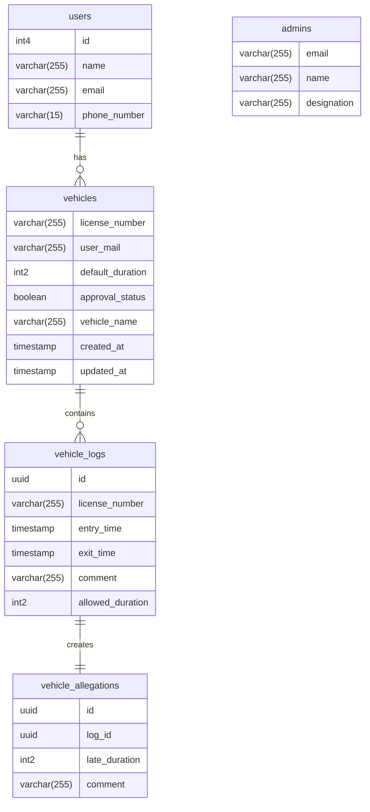

# Traffic Record Management System <!-- omit in toc -->

***

## Introduction <!-- omit in toc -->

***

[//]: # (TODO: Write introduction)

## Table of Contents <!-- omit in toc -->

***

- [Installation](#installation)
- [Usage](#usage)
- [ER Diagram](#er-diagram)
- [API Documentation](#api-documentation)
  - [Models](#models)
    - [User Model](#user-model)
    - [Admin Model](#admin-model)
    - [Vehicle Model](#vehicle-model)
    - [VehicleLog Model](#vehiclelog-model)
    - [VehicleAllegation Model](#vehicleallegation-model)
  - [Services](#services)
    - [User Services](#user-services)
    - [Admin Services](#admin-services)
    - [Vehicle Services](#vehicle-services)

## Installation

***

[//]: # (TODO: Write installation procedure)

## Usage

***

Clone this repository:

```bash
git clone github.com/Talha76/TrafficRecordManagementSystem
```

Change directory to the project directory, and run the following commands:

```bash
npm install # install dependencies
npm run dev # run the project in development mode
```

The server will run at http://localhost:3000.

[//]: # (TODO: Write remaining usage procedure)

## ER Diagram



## API Documentation

***

## Models

### User Model

#### Properties

| Name        |   Type    |
|-------------|:---------:|
| id          | `INTEGER` |
| name        | `STRING`  |
| email       | `STRING`  |
| phoneNumber | `STRING`  |

### Admin Model

#### Properties

| Name        |   Type    |
|-------------|:---------:|
| email       | `STRING`  |
| name        | `STRING`  |
| designation | `STRING`  |

### Vehicle Model

#### Properties

| Name            |   Type    |
|-----------------|:---------:|
| licenseNumber   | `STRING`  |
| userMail        | `STRING`  |
| defaultDuration | `INTEGER` |
| approvalStatus  | `BOOLEAN` |
| vehicleName     | `STRING`  |

### VehicleLog Model

#### Properties

| Name          |   Type   |
|---------------|:--------:|
| id            |  `UUID`  |
| licenseNumber | `STRING` |
| entryTime     |  `DATE`  |
| exitTime      |  `DATE`  |
| comment       | `STRING` |

### VehicleAllegation Model

#### Properties

| Name          |   Type    |
|---------------|:---------:|
| id            |  `UUID`   |
| logId         |  `UUID`   |
| lateDuration  | `INTEGER` |
| comment       | `STRING`  |

## Services

### User Services

| Method                    | Return Type | Description                                |
|---------------------------|:-----------:|--------------------------------------------|
| `async findUserById()`    |   `User`    | Finds a user by id.                        |
| `async findUserByEmail()` |   `User`    | Finds a user by email.                     |
| `async createUser()`      |   `User`    | Creates a new user.                        |
| `async updateUser()`      |   `User`    | Updates a user.                            |
| `async addVehicle()`      |   `User`    | Adds a vehicle to the user's vehicle list. |
| `async getVehicleList()`  | `Vehicle[]` | Gets the user's vehicle list.              |

#### Usage

```javascript
// You can import whole namespace as follows:
import * as UserService from './services/UserService';

// Or you can import necessary methods as follows:
// import { findUserByEmail, updateUser } from './services/UserService';

const user1 = await UserService.findUserById(1);
const user2 = await UserService.findUserByEmail('example@mail.xyz');

// All the fiels are required in createUser method
const user3 = await UserService.createUser({
  id: 3,
  name: 'User 3',
  email: 'user3@mail.org',
  phoneNumber: '01234567890'
});

// In case of the following methods, you must pass at least one of the following parameters:
// 1. id, and/or 2. email

// Other fields are optional in updateUser method
const user1 = await UserService.updateUser({
  id: 1,
  name: 'User 1',
});
const user2 = await UserService.updateUser({
  email: 'example@mail.xyz',
  name: 'User 2',
});
const user3 = await UserService.updateUser({
  id: 3,
  email: 'user3@mail.org',
  name: 'temporary user 3'
});

// At least one of `userID` or `userMail` is required in addVehicle method
// licenseNumber and vehicleName are required in addVehicle method
const user2 = await UserService.addVehicle({
  licenseNumber: '1234',
  userMail: 'example@mail.xyz'
});

// At least one of `userID` or `userMail` is required in getVehicleList method
const vehicleList = await UserService.getVehicleList({
  userMail: 'example@mail.xyz'
});
```

### Admin Services

| Method                      | Return Type | Description              |
|-----------------------------|:-----------:|--------------------------|
| `async findAdminByEmail()`  |   `Admin`   | Finds an admin by email. |

#### Usage

```javascript
// You can import whole namespace as follows:
import * as AdminService from './services/AdminService';

// Or you can import necessary methods as follows:
// import { findAdminByEmail } from './services/AdminService';

const admin = await AdminService.findAdminByEmail('example@mail.xyz');
```
