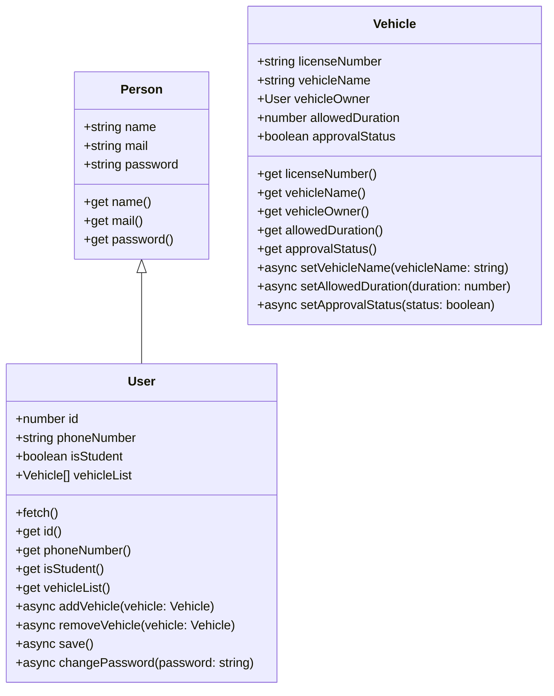

# Traffic Record Management System <!-- omit in toc -->

***

## Introduction <!-- omit in toc -->

***

[//]: # (TODO: Write introduction)

## Table of Contents <!-- omit in toc -->

***

- [Installation](#installation)
- [Usage](#usage)
- [Class Diagram](#class-diagram)
- [API Documentation](#api-documentation)
- [Classes](#classes)
  - [Vehicle](#vehicle)
    - [Properties](#properties)
    - [Constructor](#constructor)
  - [User](#user)
    - [Properties](#properties-1)
    - [Methods](#methods)

## Installation

***

[//]: # (TODO: Write installation procedure)

## Usage

***

Clone this repository:

```bash
git clone github.com/Talha76/TrafficRecordManagementSystem
```

Change directory to the project directory, and run the following commands:

```bash
npm install # install dependencies
npm run dev # run the project in development mode
```

The server will run at http://localhost:3000.

[//]: # (TODO: Write remaining usage procedure)

## Class Diagram



## API Documentation

***

## Classes

### Vehicle

#### Properties

| Name             |    Type    | Available getter     | Available setter                             |
|------------------|:----------:|----------------------|----------------------------------------------|
| licenseNumber    |  `string`  | `licenseNumber`      |                                              |
| vehicleOwner     |   `User`   | `vehicleOwner`       |                                              |
| vehicleName      |  `string`  | `vehicleName`        | `async setVehicleName(vehicleName: string)`  |
| allowedDuration  |  `number`  | `allowedDuration`    | `async setAllowedDuration(duration: number)` |
| approvalStatus   | `boolean`  | `approvalStatus`     | `async setApprovalStatus(status: boolean)`   |

#### Constructor

```typescript
const vehicle = new Vehicle({
  licenseNumber: null,      // Initially set to null
  vehicleOwner: null,       // Initially set to null
  vehicleName: null,        // Initially set to null
  allowedDuration: 20,      // Initially set to 20 minutes
  approvalStatus: false,    // Initially set to false
});
const user = vehicle.vehicleOwner;
console.log(vehicle.licenseNumber, vehicle.vehicleName);
```

### User

#### Properties

| Name        |    Type     | Available getter | Available setter                         |
|-------------|:-----------:|------------------|------------------------------------------|
| id          |  `number`   | `id`             |                                          |
| name        |  `string`   | `name`           |                                          |
| mail        |  `string`   | `mail`           |                                          |
| password    |  `string`   | `password`       | `async changePassword(password: string)` |
| phoneNumber |  `string`   | `phoneNumber`    |                                          |
| isStudent   |  `boolean`  | `isStudent`      |                                          |
| vehicleList | `Vehicle[]` | `vehicleList`    |                                          |

#### Costructor

```typescript
let user = new User({
  name: null,               // Initially set to null
  mail: null,               // Initially set to null
  password: null,           // Initially set to null
  id: null,                 // Initially set to null
  phoneNumber: null,        // Initially set to null
  isStudent: false,         // Initially set to false
  vehicleList: []           // Initially set to empty array
});

// Or you can fetch data of an user with a particular mail
user = new User({
    mail: 'example@gmail.com'
});
await user.fetch();
console.log(user.name, user.mail, user.password, user.id, user.phoneNumber);
console.log(user.isStudent, user.vehicleList);
```

#### Methods

| Name                                    | Return Type | Description                                                            |
|-----------------------------------------|:-----------:|------------------------------------------------------------------------|
| `async fetch()`                         |   `void`    | After initializing a user, call `fetch()` to fetch data from database. |
| `async addVehicle(vehicle: Vehicle)`    |   `void`    | Adds a vehicle to the user's vehicle list.                             |
| `async removeVehicle(vehicle: Vehicle)` |   `void`    | Removes a vehicle from the user's vehicle list.                        |
| `async save()`                          |   `void`    | Saves the user's data to the database.                                 |
