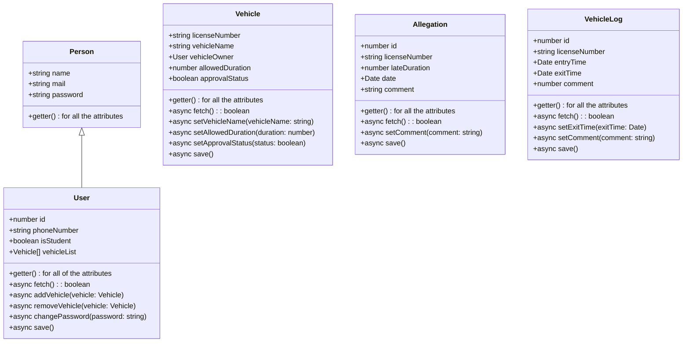

# Traffic Record Management System <!-- omit in toc -->

***

## Introduction <!-- omit in toc -->

***

[//]: # (TODO: Write introduction)

## Table of Contents <!-- omit in toc -->

***

- [Installation](#installation)
- [Usage](#usage)
- [Class Diagram](#class-diagram)
- [API Documentation](#api-documentation)
- [Classes](#classes)
  - [Vehicle](./docs/Vehicle.md)
  - [User](./docs/User.md)
  - [Allegation](./docs/Allegation.md)
  - [VehicleLog](./docs/VehicleLog.md)

## Installation

***

[//]: # (TODO: Write installation procedure)

## Usage

***

Clone this repository:

```bash
git clone github.com/Talha76/TrafficRecordManagementSystem
```

Change directory to the project directory, and run the following commands:

```bash
npm install # install dependencies
npm run dev # run the project in development mode
```

The server will run at http://localhost:3000.

[//]: # (TODO: Write remaining usage procedure)

## Class Diagram



## API Documentation

***

## Classes

- [Vehicle](./docs/Vehicle.md)
- [User](./docs/User.md)
- [Allegation](./docs/Allegation.md)
- [VehicleLog](./docs/VehicleLog.md)


